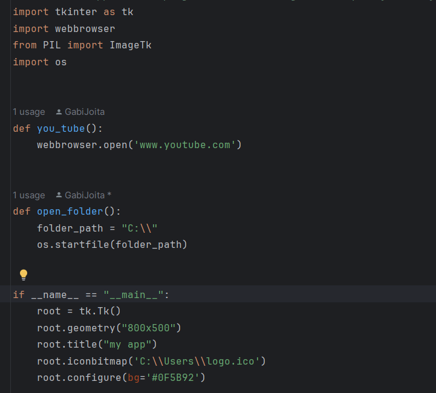

# open link directly app

Note:
```
A simple app that can help you access a website or a folder, quickly
```

Important:
```
make sure you imported these 4 modules, before started:

import tkinter as tk
import webbrowser
from PIL import ImageTk
import os

And don't forget to add a path on the function created to open the folder location
```

Code preview:
